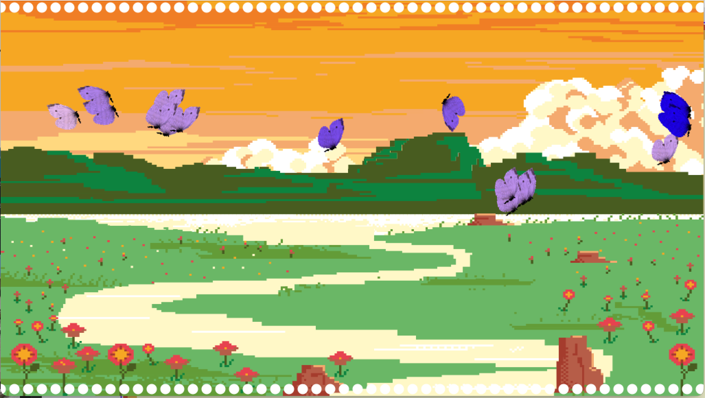

# Seasonal Woodland

## Authors
Simone Sechi

* Audio Classification and graphical interface

Rebecca Superbo

* Graphical interface and sound design

Pierluigi Tartabini

* Musical composition and sound design
## Abstract
Seasonal Woodland is an artistic installation that enables children to play and discover music feelings and sensations through interaction and visualization. The main aspect of the project is the music knowledge model that the kid builds himself from the interaction with the installation.

The aim of the Seasonal Wood is that the children is, at the same time, an artist and a music composer with only one simple motion,that is hit the board with a stick. Based on wich stick the kid chooses to strike the board, he/she will listen and see different effects, that will learn him/her something about music basic concepts.

## Description
Seasonal Woodland is thought to be an artistic installation following a full-fledged conversational model, involving sound and visual interaction. The target audience are children (of at least 4 years old) and the learning curve is zero, as the only requested action is that of hitting a wooden board with two different sticks, which will change the entire auditive and visive scenario.

Our goals are:

* To make children play while witnessing to musical and graphical changes.
* To make them understand basic concepts of musical consonance and dissonance and relating those to the concept of the changing of seasons.

## How it works
There are three components: the child, a wooden board and two sticks. The sticks are different for their top: in a stick we have an heart and in the second one we have a sphere. By hitting the board. the child will compose his/her music and change the visualization,in fact each stick has its own feature, in particular:

* **heart stick** : hitting the wood board with this stick directs the music composition in a prodcution of squeaky audio. In the visualization part, the child will see the autumn season with the leaves acting as boids, but with their trajectories disturbed and almost uncorrelated. They have primary color to recall Autumn season.

* **sphere stick** : hitting the wood board with this stick directs the music composition in a prodcution of a major background chords, to give a perception of straightforwardness. In the visualization part the Autumn season becomes Spring, and the leaves are transformed into butterflies. These animals have an harmonious movement, coordinated between them; furthermore if they meeet each other, they aggregate theirselves into flocks.

### Visualization

    
    

### Music
The music generation is composed by 2 factors: **harmony** and **melody**. 

The harmony is made by the succession of the chords, if there isn't any kick the progression will be made by major chords; if the child does some action, the progession will be influenced by his choice: in this case the next chord will be computed with the Markov chain model.

The melody is strictly dependent from the chord: if this one is major or minor the composition is made of narrow intervals starting form first or third grade; if the chord is diminuished the melody will be made of large intervals starting from randomly positions of the derived scale.

## Technology
Python: audio classification and musical composition.

Supercollider: sound design.

Processing: graphical interface.
## How to run locally

### Step 1
To try the Seasonal Woodland in your pc you have, first of all, to have installed Pyton, Processing and Supercollider.
For the hardware part you will get:
* a wooden board that will be hitten.
* two types of sticks to strike the table.
* one or more piezo to detect the hits.
* an audio card that transmits the strikes to the pc.

### Step 2
Before running the project you have to train your audio classification script; we recommend you to strike the table sequentially with a metronome beat, store the audio with a digital audio workstation (like Reaper) and train your script with the extracted data.

### Step 3
You have to initialize the NetAddress (and the relative port), the synthetizers, the OscReciever and the OscFunc in Supercollider to allow the comunication between Python and Supercollider. You will have to start Processing and after that you have to run the main.py file and (......); once you did it you can start playing with the Seasonal Woodland.

